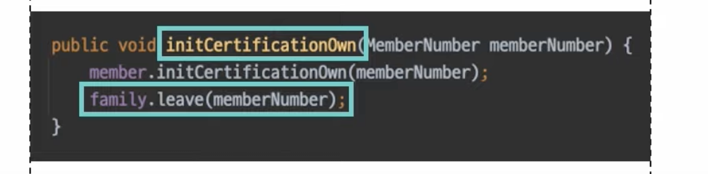
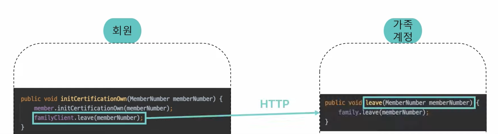
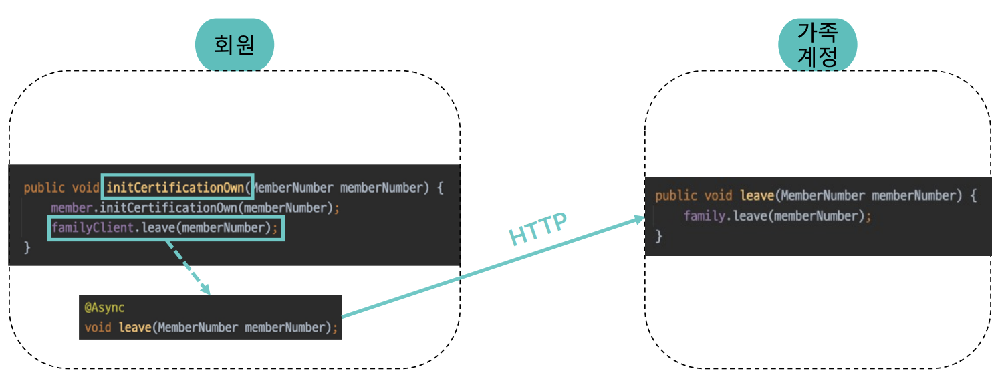
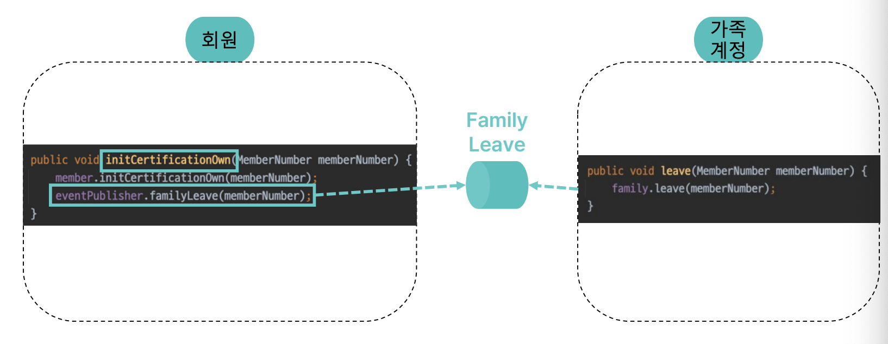
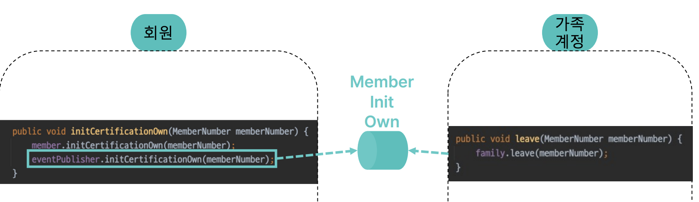
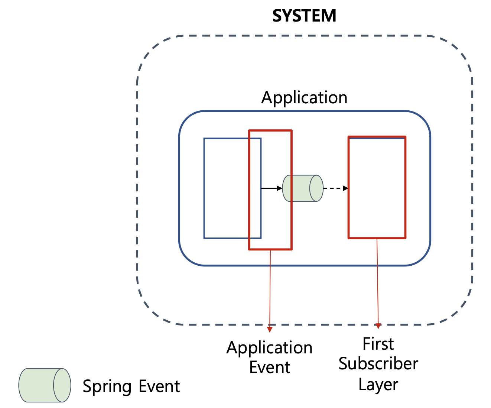
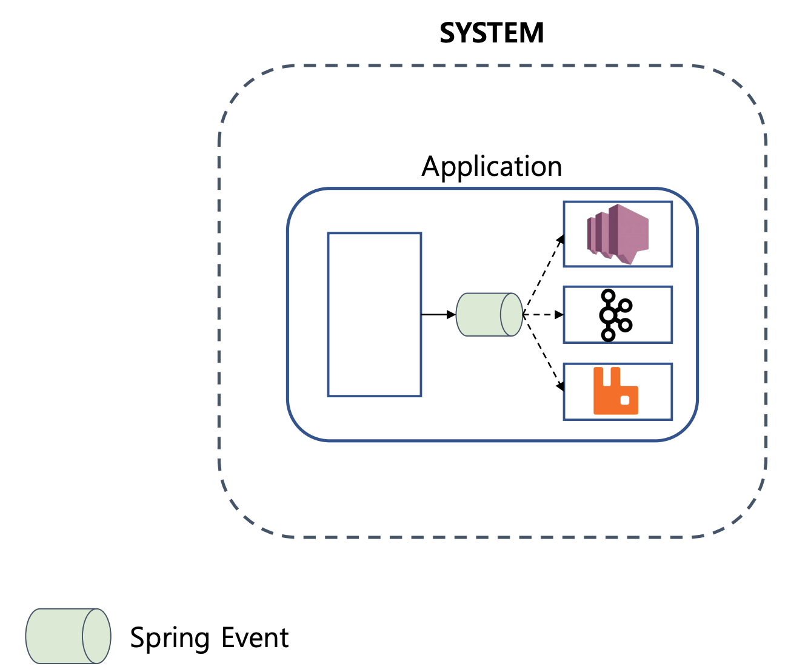

# [221020] [우아콘2022] 회원시스템 이벤트 아키텍처 구축하기

## 무엇을 이벤트로 발행할 것인가?

### 문제 상황 설명

- 2개 도메인 존재
    - 회원
    - 가족 계정 (회원들을 묶은 그룹)
- 문제 상황
    - 회원의 본인인증이 초기화되는 경우 가족 계정 서비스에서 탈퇴 되어야 한다.
    - 강한 경합 발생 (회원인증 초기화, 가족계정 탈퇴)
      

### 마이크로 서비스로 분리

- 트래픽의 증가로 가족 계정 도메인이 마이크로 서비스로 분리될 필요성 생김
- 가족 계정 서비스를 원격 클라이언트로 취급하면서 동기적인 http 요청으로 변경하게됨
  

- 결과
    - **여전히 강한결합 상태로 물리적인 시스템 분리로 느슨한 결합을 만들 수 없음**

### 비동기 요청 by HTTP

- 
- 비동기로 처리된 HTTP 요청은 **스레드 레벨에서 의존을 제거할뿐**
- 결과
    - **회원 본인인증 초기화 작업에 가족 계정 후속행위가 필요한것은 그대로** -> 여전히 강한결합

### 비동기 요청 by 메세징 시스템 (강결합 ver)

- **가족계정 탈퇴 메세지**를 큐로 전송하고, 가족 계정 시스템은 이를 구독하여 탈퇴를 처리
- 결과
    - 메세징 시스템을 사용하는 아키텍처가 항상 느슨한 결합을 보장하지는 않는다.
    - 발행하는 **메세지가 대상 도메인에게 기대하는 목적을 담는다면** 비동기 요청일뿐 느슨한 결합이 아님.
        - 메세지를 발송하는것으로 **물리적인 의존은 제거**되었지만,
        - 가족 계정 **탈퇴를 기대하는 메세지를 발행**했기때문에
        - **논리적인 의존관계가 남아있음**
    - **여전히 강한결합**

### 비동기 요청 by 메세징 시스템 (느슨한 결합 ver)

- **본인 인증 해제 이벤트**를 발송하고, 가족 계정 시스템은 이를 구독하여 탈퇴를 처리
- 결과
    - 회원 시스템은 가족 계정 비즈니스에 관여하지 않았기 때문에 **느슨한 결합**

### 정리

- 우리가 발행해야할 이벤트는 **이벤트로 인해 달성하려는 목적이 아닌** **도메인 이벤트 그 자체여야 함**

## 이벤트 발행과 구독

### 어플리케이션 이벤트 & 첫번째 구독자 계층

> - 스프링의 어플리케이션 이벤트?
    >
- 분산 비동기를 다룰 수 있는 이벤트 버스를 제공
>   - 트랜잭션 제어 지원
>   - -> 따라서 **단일 어플리케이션 내에서 사용**하기에좋음
      >
- 단일 어플리케이션 내에서 이벤트를 다루는 이유?
>     - 이벤트를 통해 느슨한 결합을 만들어야 하는 일이 외부 세상에서만 존재하는게 아님

- **첫번째 구독자 계층에 어플리케이션 이벤트를 메세징 시스템으로 전달**하는 **구독자** 생성

    - 
    - 어플리케이션 내에서 대표적인 도메인의 비관심사는 메세징 시스템으로 이벤트를 발행하는것이다.
    - 이벤트 구독은 발행 시스템에 영향없이 **자유롭게 확장이나 변경**이 가능하다.
    - 도메인에 영향없이 메세징 시스템에 대한 연결을 쉽게 작성하고 확장하고 변경할 수 있다.
    - 

### 내부 이벤트 & 두번째 구독자 계층

- 

- **내부 이벤트**
    - 첫번째 계층의 구독자가 발행하는 이벤트
    - sns는 sqs와 함께 사용
        - 1대m 구독이 가능해지고
        - 메세지 유실에 강한 신뢰 확보가능
- **두번째 구독자 계층**
    - 발행된 내부 이벤트는 시스템 내에 이벤트 처리를 담당하는 이벤트 처리기(Event Worker)가 구독하게된다.
- 비교 (vs 첫번째 구독자)
    - 첫번째 구독자 계층은 어플리케이션 내에서 해결해야 하는 비관심사를 처리
    - 두번째 구독자 계층은 이외 모든 도메인의 비관심사를 처리

## 비관심사 분리

- 비관심사란?
    - 도메인이 수행될때 함께 수행되야하는 정책
- 비관심사는 도메인의 주행위에 대한 응집을 방해하게 된다.

### 로그인 프로세스 예시

- 프로세스
    - 
    - 회원이 로그인하면 로그인 상태로 변경하고,
    - 디바이스를 기록하고,
    - 동일 계정 로그인수 제한 규칙에 따라 동일 계정의 로그인된 타 디바이스를 로그아웃 처리하고
    - 누락되었을 수도 있는 동일 디바이스의 다른 계정을 로그아웃 처리하여 정확한 정보를 관리해야한다.
- 문제점
    - 
    - 부가정책들이 도메인 로직과 함께 작성되어 **도메인의 주행위가 무엇인지 알기 어렵다.**
- 내부 이벤트
    - 
    - 로그인 내부 이벤트 발행한 다음 SNS sqs 메세징 시스템을 통해 하나의 이벤트를 여러 구독으로 나누어 처리할 수 있음
    - 각각의 정책이지만 만약 구현이 서로 영향을 받게되면 적절한 분리 필요
    - 주요기능을 찾고 비관심사를 분리해서 **도메인의 행위가 응집을 높이고 비관심사에 대한 결합을 느슨하게** 된다.

## 어플리케이션 이벤트 vs 내부 이벤트

> 비관심사 처리는 어플리케이션 이벤트로도 할 수 있는것 아닌가?

### Tradeoff

- 어플리케이션 이벤트

    - 주요 행위와 트랜잭션 공유
    - 주요 행위와 성능을 공유

  > 주요 행위와 강한 정합성을 보장이 필요한 작업

- 내부 이벤트

    - 주요 행위와 트랜잭션 분리
    - 주요 행위와 성능 분리

  > 주요 행위와 강한 정합성 보장이 필요하지 않은 작업

## 외부 이벤트 발행

### **외부 이벤트란?**

- msa 를 구성하는 타시스템들이 구독하는 이벤트다.

    - 두번쨰 구독자 계층이 또 다른 메세지 시스템으로 이벤트를 발행

- > 시스템 내 비관심사를 분리했지만, msa를 위한 **외부 시스템과의 분리**를 위한 외부 이벤트 발행이 필요. 외부 시스템의 이벤트를 전파하는것도 도메인 내에 존재하는 비관심사.

## 열린 내부이벤트, 닫힌 외부 이벤트

> - 세번쨰 구독자 계층이 내부 이벤트를 품으면 안되는가?
    >
- 내부, 외부 이벤트를 분리함으로써
  > 내부에는 열린, 외부에는 닫힌 이벤트를 제공 가능한 장점

- 내부 이벤트

    - 
    - 비즈니스가 변경되면서 시스템에 나이를 제거하고자함.
        - 페이로드에 단순히 나이를 제거하면 사용하던 구독자들은 오류발생
    - **하지만 페이로드를 변경가능**
        - **내부 이벤트는 발행자와 구독자 모두 하나의 시스템 안에 있다.**
        - 이벤트 발행과 구독이 구독자에게 미치는 영향을 파악하고 관리할수있다.
        - 구독자가 필요한 이벤트를 페이로드에 제공 가능  (=열려있다.)
    - 내부이벤트는 도메인에 존재하는 비관심사를 분리하여 도메인의 응집도를 높이고 비관심사를 처리하는 것을 목적으로한다.

- 외부 이벤트

    - 

    - 세번째 구독자 계층은 외부에 있다.

    - 페이로드의 데이터를 변경하게 된다면 구독자들은 오류발생

    - **하지만 타시스템은 관리할 수 없다.**

        - **유관부서 파악하고 많은 비용 발생**
        - 함부로 데이터를 넣었다가는 다시는 제거하지 못할수 있다. (닫혀있다)

    - 외부 이벤트는 시스템과 시스템의 결합을 줄이는 것을 목적으로한다.

        - 시스템간의 결합을 느슨하게 만들기 위해 발행되는 외부이벤트는 이벤트 발행처에서 이벤트 구독자가 어떤 행위를 하는지 관심을 가지면 안되며, 관리할 수 없다.

## 이벤트 일반화

- 이벤트를 인지하는 과정을 쉽게 일반화 할 수 있다.

  

- 아래 속성이 있다면 어떠한 시스템에서도 필요한 이벤트를 인지할수있다.
    - 언제 (시간)
    - 누가 (식별자)
    - 무엇을 하여 (행위)
    - 어떤 변화가 (속성)
- 데이터가 더 필요하다면?
    - **이벤트는 구독자의 행위를 기대하지 않아야 느슨한 결합을 가져갈 수 있다.**
    - 따라서 특정 구독자를 위한 데이터를 추가할 수 없다.
        - 해결법?
        - Zero payload 방식
            - 1.이벤트 순서에 대한 보장 문제 해소
            - 2.**페이로드의 외부시스템에 대한 의존 제거할 수 있는 장점**
        - 

### 정리

- 어플리케이션 이벤트을 통해 이벤트 발행에 대한 비관심사를 제어
- 내부 이벤트을 통해 내부의 비관심사를 분리할 수 있었고,
- 외부 이벤트를 통해 외부 시스템과의 의존없는 이벤트를 발행

## 이벤트 저장소 구축

- 스프링 어플리케이션 이벤트의 기능으로 도메인 행위와 구독자의 행위를 트랜잭션으로 묶어 이벤트 발행에 실패하면 도메인 행위도 실패하게 할 수 있지만,

- 문제점

    - 내부 이벤트를 발행하는 구간은 http 통신을 사용하기 때문에 발행하는 과정에서 문제 발생가능

    - 트랜잭션으로 모두 묶으면?

        - 

        - 메세징 시스템의 장애가 시스템 전체의 장애로 번질 수 있는 위험

    - 도메인 행위와 이벤트 처리를 별도 트랜잭션으로 사용하게 되면?

        - 
        - http 요청이 실패하면 이벤트가 유실되면서 도메인 행위가 수행됐는데 이벤트는 발행되지 않는 브릿지 상태가 발생가능
        - 이벤트 발행에 대한 보장이 없음.

    - 해결법

        - 이벤트 저장소

  ## 이벤트 저장 시점

    - 
    - 따라서 이벤트 발행을 이벤트 저장소를 통해 만족시켜야함.
        - sns 이벤트 발행에 실패하여도 도메인의 행위가 성공했다면 이벤트 저장소에 이벤트가 저장될것이기에 어떻게든 이벤트를 재발행 가능

## 저장소 선택

- 필요 조건

    - 작은 단위로 저장이 되고 고속 처리가 되어야 한다.
    - 도메인 행위와 이벤트간 신뢰성 확보를 위해서 **필수적으로 트랜잭션을 묶을 수 있는 저장소인지 확인** 필요
    - 

    - 다중 데이터 베이스에 분산 트랜잭션을 구현해야하지만 굉장히 어려움

- 선택 해야함  (후자선택)
    - 낮은 확률로 유실이 발생할 수 있는 다중 데이터 베이스 vs 유실이 발생할 수 없도록 데이터베이스 공유
- 해결법
    - 트랜잭셔널 아웃박스 패턴
        - 동일 저장소를 통해 데이터베이스를 저장하고 이벤트를 발행함에 안정적인 정합성을 보장하는 방식
        - 로컬트랜잭션을 사용해서 데이터베이스를 저장하고 이벤트를 발행함에 정합성을 보장

## 데이터 형태

- 

## 이벤트 유실문제 해결

- 이벤트 저장소에 발행여부 데이터를 정의
    - 
    - 최초 이벤트를 기록할 때는 발행 여부를 `false`로 저장하고, 두번째 구독자 계층에 이벤트 발행 여부를 기록하는 구독자를 추가하여 데이터를 업데이트 처리
    - (과정 상세 생략 19:00~)

## 기록 테이블 통합

- 회원 시스템에 별도 로그 테이블이 필요했는데
- 이를 이벤트 저장소를 통해 대체가 가능했음.
- 따라서 별도 테이블을 필요하지 않게됨

# Reference

- https://www.youtube.com/watch?v=b65zIH7sDug&t=132s
- https://techblog.woowahan.com/7835/
