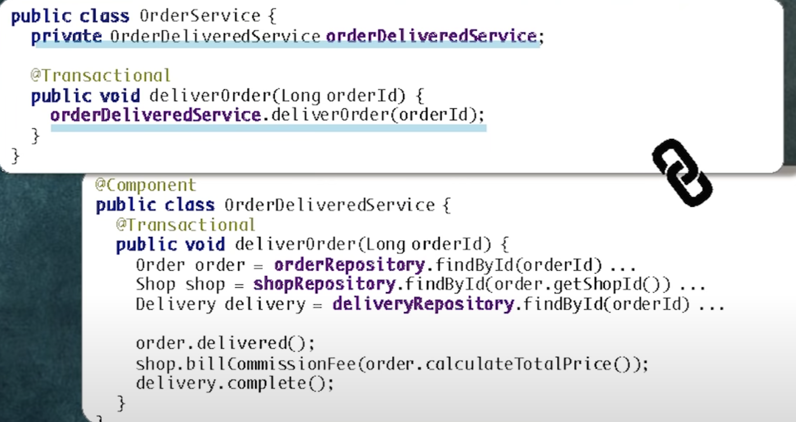

# [190620] [우아한테크세미나]  우아한객체지향 by 조영호님

## **어떤 객체들을 묶고 어떤 객체들을 분리할 것인가?**


- 간단한 규칙
    - **함께 생성되고 함께 삭제되는 객체**들을 함께 묶어라
    - **도메인 제약사항을 공유하는 객체**들을 함께 묶어라
    - **가능하면 분리**하라
- TIP
    - **시스템 비즈니스에 따라 분리하는 기준이 다르다**.
        - Life cycle
            - 장바구니, 장바구니 항목을 하나로 묶어야 한다고 생각하지만, 장바구니가 생성되는것과 장바구니 항목을 추가/삭제하는 시점(life cycle)은 다르다. 장바구니는 미리 사용자별로 만들어 놓은것이다.
        - 도메인 제약사항 관련
            - 보통 이커머스는 장바구니에 A, B 다 넣을수 있다 -> 도메인 제약사항을 공유하지 않음
            - 배민은 장바구니에 동일한 업소것만 넣을 수 있으므로 공유 -> 장바구니에 A,B를 넣으면 A,B와 장바구니의 도메인 제약사항은 공유 -> 하나의 객체로 묶음

## **객체 묶기 예시**


- shop과 menu의 생성시점, constraints 가 서로 다르고 독립적이다. + 주문, 배송도 독립적

- **경계 안에 들어가있는 객체는 참조를 이용해 접근**

    - 연관관계로 묶는것이 편하다. -> 같이 읽고, 생성 ,수정 되기 때문이다.

    - ```java
    @Entity
    @Table(name="ORDERS")
    public class Order {
        @OneToMany(cascade = CascadeType.ALL)
        @JoinColumn(name="ORDER_ID")
        private List<OrderLineItem> orderLineItems;
    }
    ```

      ```java
      @Entity
      @Table(name="ORDER_LINE_ITEMS")
      @Getter
      public class OrderLineItem {
      }
      ```

- **경계밖의 객체는 ID를 이용해 접근**

    - ```java
    @Entity
    @Table(name="ORDERS")
    public class Order {
        @OneToMany(cascade = CascadeType.ALL)
        @JoinColumn(name="ORDER_ID")
        private List<OrderLineItem> orderLineItems;
        
        @Column(name = "SHOP_ID")
        private Long shopId;
    }
    ```

## **객체 묶기 결과**


- Order의 Shop을 탐색하고 싶다면?

    - Shop Repository를 통해 탐색

      ```java
      Shop shop = shopRepository.findById(order.getShopId())
      ```

- 트랜잭션 단위가 된다.

- 조회 경계가 됨

    - 어디까지 eager loading 혹은 lazy loading 할것인가?의 기준이 될수있다.

- 일단 참조 없는 객체 그룹으로 나누고 나면 그룹 단위의 영속성 저장소 변경 가능

    - order 그룹 mongodb로 바꾸거나..

- 그룹은 트랜잭션/조회/비즈니스 제약의 단위

    - 

## 컴파일 에러 #1 : 객체참조를 Id로 바꿨을때 해결법

- https://youtu.be/dJ5C4qRqAgA?t=4742

- 문제되는 상황

    - 
    - 

- 해결법#1 : 객체를 직접 참조하는 로직을 다른 객체로 옮기자!

    - 새 객체 OrderValidator를 준비하고 Validation Logic을 이동시키자.
        - 

    - Validation Logic 모으기

        - 컴파일 에러나는것들을 모두 집어 넣자.

      ```java
      @Component
      public class OrderValidator {
          private ShopRepository shopRepository;
          private MenuRepository menuRepository;
      
          public OrderValidator(ShopRepository shopRepository,
                                MenuRepository menuRepository) {
              this.shopRepository = shopRepository;
              this.menuRepository = menuRepository;
          }
      
          public void validate(Order order) {
              validate(order, getShop(order), getMenus(order));
          }
      
          void validate(Order order, Shop shop, Map<Long, Menu> menus) {
              if (!shop.isOpen()) {
                  throw new IllegalArgumentException("가게가 영업중이 아닙니다.");
              }
      
              if (order.getOrderLineItems().isEmpty()) {
                  throw new IllegalStateException("주문 항목이 비어 있습니다.");
              }
      
              if (!shop.isValidOrderAmount(order.calculateTotalPrice())) {
                  throw new IllegalStateException(String.format("최소 주문 금액 %s 이상을 주문해주세요.", shop.getMinOrderAmount()));
              }
      
              for (OrderLineItem item : order.getOrderLineItems()) {
                  validateOrderLineItem(item, menus.get(item.getMenuId()));
              }
          }
      
          private void validateOrderLineItem(OrderLineItem item, Menu menu) {
              if (!menu.getName().equals(item.getName())) {
                  throw new IllegalArgumentException("기본 상품이 변경됐습니다.");
              }
      
              for(OrderOptionGroup group : item.getGroups()) {
                  validateOrderOptionGroup(group, menu);
              }
          }
      
          private void validateOrderOptionGroup(OrderOptionGroup group, Menu menu) {
              for(OptionGroupSpecification spec : menu.getOptionGroupSpecs()) {
                  if (spec.isSatisfiedBy(group.convertToOptionGroup())) {
                      return;
                  }
              }
      
              throw new IllegalArgumentException("메뉴가 변경됐습니다.");
          }
        private Shop getShop(Order order) {
              return shopRepository.findById(order.getShopId()).orElseThrow(IllegalArgumentException::new);
          }
      
          private Map<Long, Menu> getMenus(Order order) {
              return menuRepository.findAllById(order.getMenuIds()).stream().collect(toMap(Menu::getId, identity()));
          }
      }
      ```

    - OrderValidator를 이용한 구현

        - Order Service에서는 OrderValidator를 주입한다음 parameter로 넘기고 그 안에서 validate 호출한다.
          ```java
          @Service
          public class OrderService {
              private OrderRepository orderRepository;
              private OrderValidator orderValidator;
              private OrderMapper orderMapper;
            
              @Transactional
              public void placeOrder(Cart cart) {
                  Order order = orderMapper.mapFrom(cart);
                  order.place(orderValidator);
                  orderRepository.save(order);
              }
          }
          ```

          ```java
          public class Order { 
           public void place(OrderValidator orderValidator) {
                  orderValidator.validate(this);
                  ordered();
              }
          }
          ```

        - 기존과 비교
            - 객체지향은 여러 객체를 오가며 로직 파악하는 반면 전체 Validation Logic을 한눈에 볼수있다.
                - 객체지향은 위 예시처럼 validate 로직이 여러 객체에 분산되어있어서 파악하기가 어렵다는 뜻
            - Order에 validation 로직이 들어있을때는 응집도가 낮다.
                - 응집도란?
                    - 관련된 책임의 집합.
                    - 다르게 이야기하면
                        - 같이 변경되는 애들이 같이 있으면 높은것이다.
                        - 같이 변경되지 않는 애들이 같이 있으면 낮은것.
                - Order 객체는 응집도가 낮다.
                    - Validation 로직이 바뀔때와 주문 처리 로직이 바뀔때 변경의 주기가 다름.
                      
                - 높은 응집도의 객체로 (단일 - 책임 원칙)
                    - 
            - **때로는 절차지향이 객체지향보다 좋다.**
                - 
                - 전체의 flow를 한눈에 보기좋음.
                - 물론 단위테스트가 어려울 수 있음.
                - 객체안의 상태를 **조금 체크하는 것이면 해당 객체에 들어있는것이 맞다.**
                  하지만 그 **객체 상태를 validation하기 위해서 여러 객체를 참조해야 하면 응집도가 낮아지며 분리**해야한다.

## 컴파일 에러 #2 : 배달완료

```java
public class OrderService{
    @Transactional
    public void deliverOrder(Long orderId) {
        Order order =orderRepository.findById(orderId).orElseThrow(IllegalArgumentException::new);
        order.delivered();

        Delivery delivery = deliveryRepository.findById(orderId).orElseThrow(IllegalArgumentException::new);
        delivery.complete();
    }
}
```


- 원인 : 도메인 로직의 순차적 실행되기 때문
    - A가 실행됐을때 ~가 같이 실행되야 한다는 도메인의 제약사항이다.
    - 어떤 객체가 바뀔때 그 결과로 어떤 객체가 바뀌어야한다는 변경의 순서, 전후관계가 있기 때문에 이 로직이 발생.
    - 

- 두 가지 해결방법
    - 절차 지향 로직 (ordervalidator와 동일)
    - 도메인 이벤트 퍼블리싱

## 첫번째 방법 : 절차지향로직


- OrderDeliveredService를 추가하고

    - ```java
    public class OrderDeliveredService {
        @Transactional
        public void deliverOrder(Long orderId){
        }
    }
    ```

- 배달 완료 로직 이동

    - 

- 절차지향적인 OrderDeliverService

    - 
    - 장점
        - 비즈니스 로직을 한눈에 보기 좋다.
            - 원래는 주문이 완료됐을때 어떻게 되는지 클래스가 두개로 쪼개져있었다. (한눈에 파악 안됨)

- OrderService 의존성 주입

    - 

- TIP : 무언가를 변경하고나서 잘된 설게인지 판단하기 위해 의존성 관계를 그려보자.

    - **문제 : 의존성 사이클이 생김**

        - OrderDeliveredService 추가후 Shop도가져오고 Delivery도 가져오기 때문

          

        - 인터페이스를 이용해서 의존성을 역전시키자. (Dependency Inversion Principle)

            - 의존이 한 방향으로 감
            - 

- 패키지 의존성이 있을때 사이클 없애는 방법

    - # 1 추상적인 중간 객체를 만들어서 변환
    - # 2 인터페이스나 추상 클래스를 넣어서 역전시키는 방법

## 두번째 방법 : 도메인 퍼블리싱

- 

- 첫번째 방식과 비교

    - 첫번째 방식은 객체 참조로 결합되었던것을 Service로 한군데 모아서 객체간의 결합도는 낮지만 로직간의 결합도를 명확하게 보여주는 방법

    - 도메인 이벤트는 A라는 것이 끝났을때 B,C라는것이 실행됐으면 좋겠다.

      하지만 최대한 순서를 느슨하게 만들고싶을떄.

- Domain Event를 이용한 의존성 제거

    - 그전에는 메세지call 했지만 그냥 이벤트를 발행하고 eventhandler로 받아서 처리

      


- Order가 Shop을 직접 호출하던 로직을
    - 
    - 

- Order가 Domain Event 발행하도록 수정
    - 
    - db commit이 되면 발행이되고 처리됨

- Shop 이벤트 핸들러
    - 

- Domain Event 추가후 객체 그래프
    - 
    - 의존 사이클이 생김
    - 원인 : 이벤트핸들러가 Shop 패키지에 있기 때문이다.
    - 해결법
        - 패키지를 분리하고
            - 
        - Event Handler가 의존하는 코드를 Shop 에서 분리
            - 
        - Event Handler에서 Shop과 Billing 사용
            - 
        - Billing을 새로만든 패키지에 포함-> cycle 제거
            - 
            - 패키지에 cycle이 돌아서 찢어낼때는 도메인의 개념이 명확해지는 경우가 많다. 즉 새로운 개념이 필요. -> Shop에 정산이 들어가있는건 어색. 완전히 다르기 때문에 cycle이 도는것이다.

## (정리) 패키지 의존성 사이클 제거하는 3가지 방법


- # 1 : 새로운 객체로 변환
    - 
- # 2 : 의존성 역전
    - 
- # 3 새로운 패키지 추가
    - 
- 어떤것을 쓸것이냐는 판단에 따라 다름 (Trade-off)

## 의존성과 시스템 분리

- https://youtu.be/dJ5C4qRqAgA?t=5810

## 의문점

- 여러 테이블에 lock이 생겨서 트랜잭션 경합이 생겨서 객체 참조가 아닌 id를 사용하여 repository로 바꿨다고 했는데 그렇게 한다고해도 어차피 불러오는 객체는 동일한데 lock이 생기는 갯수와 트랜잭션 경합은 동일한것 아닌가?

## Reference

- 강의 : https://www.youtube.com/watch?v=dJ5C4qRqAgA
- 프로젝트 repository
    - 1단계 : https://github.com/eternity-oop/Woowahan-OO-01-object-reference
    - 2단계 : https://github.com/eternity-oop/Woowahan-OO-02-domain-service
    - 3단계 : https://github.com/eternity-oop/Woowahan-OO-03-domain-event
