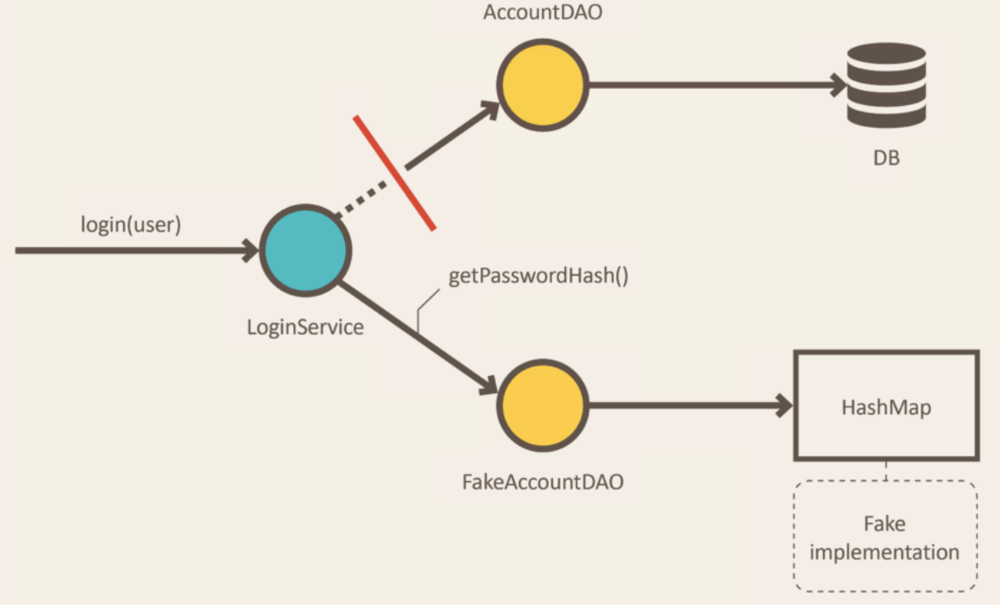
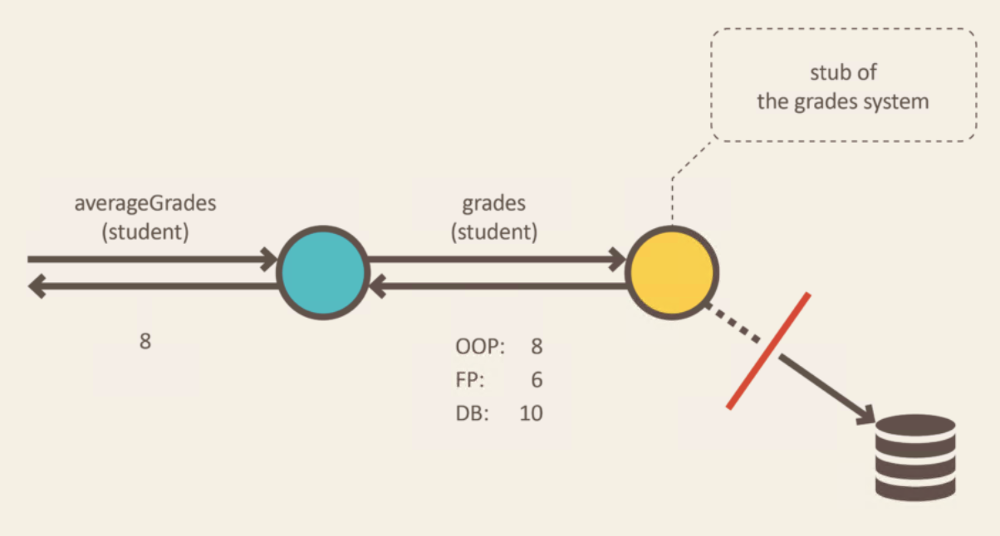

# Test Double 이란


## 왜 사용 하는가 ?

- 테스팅을 목적으로 진짜 객체대신 사용되는 모든 종류의 위장 객체다
  - ex) Dummy, Fake Object, Stub, Mock
- 장점
  - 나머지 시스템과 독립적으로 코드를 검증하게 해줌.
  - 테스트 속도 개선
  - 예측 불가능한 실행 요소를 제거
  - 특수한 상황을 시뮬레이션

<br/>

## Fake

- Fake는 실제와 동일하지는 않지만, 실제 코드를 단순화하여 구현한 객체다.  



#### 예시
```java
@Profile("transient")
public class FakeAccountRepository implements AccountRepository {

       Map<User, Account> accounts = new HashMap<>();

       public FakeAccountRepository() {
              this.accounts.put(new User("john@bmail.com"), new UserAccount());
              this.accounts.put(new User("boby@bmail.com"), new AdminAccount());
       }

       String getPasswordHash(User user) {
              return accounts.get(user).getPasswordHash();
       }
}
```
- 실제 데이터베이스를 사용하지는 않지만 간단한 컬렉션을 이용하여 데이터를 인메모리에 저장한다.
  - 시간이 많이 걸리는 데이터 베이스 요청을 단순화
  - 데이터베이스 의존하지 않으며 서비스 테스트를 수행가능

<br/>

## Stub

- 테스트를 위해 미리 준비해둔 결과를 제공하는 객체다.


#### 예시
```java
public class GradesServiceTest {
    private Student student;
    private Gradebook gradebook;

    @Before
    public void setUp() throws Exception {
        gradebook = mock(Gradebook.class);
        student = new Student();
    }

    @Test
    public void calculates_grades_average_for_student() {
        when(gradebook.gradesFor(student)).thenReturn(grades(8, 6, 10)); //stubbing gradebook
        double averageGrades = new GradesService(gradebook).averageGrades(student);
        assertThat(averageGrades).isEqualTo(8.0);
    }
}
```

<br/>

## Stub vs Mocks

### Behavior vs State testing
- Behavior testing
  - SUT가 협력객체의 특정 메서드가 호출되었지 등의 행위를 검사함으로써 올바로 동작했는지 판단하게 된다.

  ```java
  SomeClass someClass = new SomeClass();
  verify(someClass).someMethod();
  ```

- State testing
  - 메서드가 수행된 후 SUT나 협력객체의 상태를 살펴봄으로써 올바로 동작했는지를 판단하게 된다.

  ```java
  SomeClass someClass = new SomeClass();
  someClass.someMethod();
  assertThat(someMethod.someStatus()).isEqualTo(true);
  ```

### 차이점
#### 1. 스타일
- stub은 State testing 수행
- Mocks은 Behavioral tesing 수행
#### 2. 원칙
각 테스트당 하나의 테스트만 해야한다는 원칙에 따라서
- stub은 하나의 테스트에 여러개가 있을 수 있다.
- mocks는 하나의 테스트에 보통 하나만 있다.
#### 3. 생명주기
- stubs
  1. Setup : 테스트할 객체와 stub collaborator를 준비한다.
  2. Exercise : 기능 테스트
  3. verify state : 객체의 상태를 assertion으로 검증한다.
  4. teardown : 리소스 정의
- mocks
  1. Setup data : 테스트할 객체를 준비한다.
  2. __Setup expectations : 주객체가 사용하는 mock에 대한 expectations를 준비한다.__
  3. Exercise : 기능 테스트
  4. __verify expectations : mock에서 올바른 메서드가 호출되었는지 확인__
  5. verify state : 객체의 상태를 assertion으로 검증한다.
  4. teardown : 리소스 정의

> - 요약
>   - mocks와 stubs 둘다 "결과는 무엇인지"를 테스트한다.
>   - 하지만 mock는 "결과가 어떻게 달성되었는지"도 테스트

<br/>

## Reference
- Test double 이란
  - https://martinfowler.com/articles/mocksArentStubs.html
  - https://blog.pragmatists.com/test-doubles-fakes-mocks-and-stubs-1a7491dfa3da  
- mock vs stub 차이점
  - https://stackoverflow.com/questions/3459287/whats-the-difference-between-a-mock-stub
  - https://joont92.github.io/tdd/%EC%83%81%ED%83%9C%EA%B2%80%EC%A6%9D%EA%B3%BC-%ED%96%89%EC%9C%84%EA%B2%80%EC%A6%9D-stub%EA%B3%BC-mock-%EC%B0%A8%EC%9D%B4/
